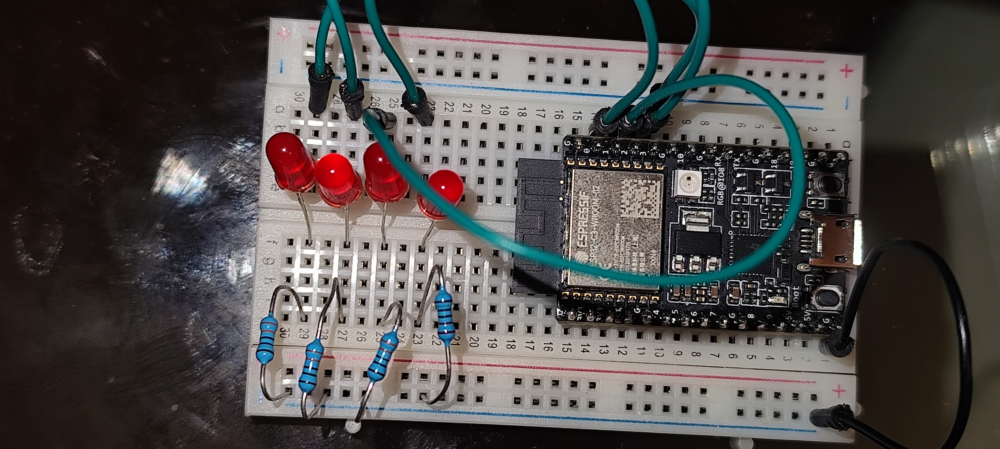

# Práctica: Fundamentos de Computadores con RISC-V

Bienvenido a la práctica de introducción a la arquitectura de computadores. En esta sesión, dejaremos de lado la abstracción de alto nivel para controlar el hardware "con las manos desnudas" utilizando ensamblador **RISC-V**.

## 🎯 Objetivos
* Entender el concepto de **Memory Mapped I/O (MMIO)**: Escribir en memoria para actuar en el mundo físico.
* Comprender las instrucciones de **desplazamiento de bits** (Shifts).
* Practicar el flujo de control en ensamblador (Bucles y Saltos).
* Visualizar la velocidad de ejecución de la CPU frente al ojo humano.

## 🛠 Material Necesario
* 1x Placa **ESP32-C3 SuperMini** (Arquitectura RISC-V de 32 bits).
* 4x LEDs Rojos.
* 4x Resistencias de 220Ω (Rojo-Rojo-Marrón) o similares.
* 1x Breadboard y cables.

## 📸 Montaje del Hardware
El montaje busca la simplicidad. Utilizaremos los pines **GPIO 0, 1, 2 y 3** como salidas.

### Vista General
Coloca el microcontrolador en la breadboard dejando espacio para los cables.


### Esquema de Conexión (El "Puente")
Debido al tamaño compacto de la placa, usaremos cables para llevar las señales a una zona más amplia de la breadboard.
1. Conecta **GND** a la línea azul (tierra) de la breadboard.
2. Conecta los **GPIO 0, 1, 2 y 3** a los ánodos (patas largas) de los LEDs.
3. Conecta los cátodos (patas cortas) a las resistencias, y estas a Tierra.


## 💻 El Reto de Software

El proyecto combina un archivo "esqueleto" en C (`main.c`) que configura los periféricos, y tu tarea principal que será programar la lógica en ensamblador (`secuencia.S`).

### Parte 1: El Desplazamiento Simple
Implementa un bucle que encienda un LED, espere un tiempo, y desplace el bit a la izquierda (`slli`). Al llegar al último LED, debe reiniciar.

**Instrucciones clave:** `li`, `sw`, `addi`, `bnez`, `slli`.

Si tu lógica de estados y retardos es correcta, deberías ver este movimiento fluido :

<video src="media/video1.mp4" controls width="100%"></video>


### Parte 2: El "Coche Fantástico" (Scanner Larson)
Modifica tu código para que la luz no se reinicie bruscamente, sino que **rebote** de lado a lado.
* Cuando llegue al bit 3 (izquierda), debe cambiar la dirección y usar desplazamientos a la derecha (`srli`).
* Cuando llegue al bit 0 (derecha), debe volver a cambiar a la izquierda.

### 🎥 Resultado Esperado
Si tu lógica de estados y retardos es correcta, deberías ver este movimiento fluido :

<video src="media/video2.mp4" controls width="100%"></video>

*(Si no puedes ver el video, revisa la carpeta media/video2.mp4)*

---

## 🚀 Compilación y Carga
Usaremos **PlatformIO** con el framework **ESP-IDF**.

### ⚠️ Importante: Rutas de Compilación
Due to limitations with OneDrive paths containing spaces and accents, **the project must be compiled from a path without spaces or special characters**.

**Recommended workflow:**
1. Copy the entire project to a temporary location: `C:\temp\practica5_temp`
2. Compile and upload from there
3. Copy modified files back to OneDrive when needed

### Estructura del Proyecto
```
src/
├── main.c              # Configuración del hardware en C
├── secuencia.S         # Tu implementación en ensamblador
└── secuencia-solucion.S # Implementación de referencia (renombrada)
```

### Comandos de PlatformIO
1. **Compilar** (desde ruta sin espacios): 
   ```bash
   pio run
   ```

2. **Subir al microcontrolador**:
   ```bash
   pio run --target upload
   ```

3. **Monitor serial** (opcional):
   ```bash
   pio device monitor
   ```

3. **Monitor serial** (opcional):
   ```bash
   pio device monitor
   ```

### Configuración CMake
El archivo `CMakeLists.txt` en `src/` debe incluir ambos archivos assembly:
```cmake
idf_component_register(SRCS "main.c" "secuencia.S" "secuencia-solucion.S" INCLUDE_DIRS ".")
```

---

## ✅ Resultado del Proyecto

### Estado de Implementación
- **✅ Compilación exitosa**: Sin errores de sintaxis o linkado
- **✅ Upload completado**: Firmware cargado correctamente en el ESP32-C3
- **✅ Funcionalidad implementada**: Patrón "Coche Fantástico" operativo

### Detalles Técnicos
- **Microcontrolador**: ESP32-C3 (RISC-V 32-bit) en puerto COM5
- **Memoria RAM utilizada**: 8,632 bytes (2.6%)  
- **Memoria Flash utilizada**: 181,636 bytes (17.3%)
- **Funciones implementadas**:
  - `ejecutar_secuencia_asm`: Implementación principal del patrón
  - `solucion_profesor`: Implementación de referencia (opcional)

### Funcionamiento
Al ejecutarse, el programa muestra:
```
¡Hardware listo! Cediendo el control al Ensamblador RISC-V...
```

Y continúa ejecutando el patrón de LEDs indefinidamente con:
- Movimiento suave de izquierda a derecha
- Rebote en los extremos (GPIO 0 y GPIO 3)
- Temporización ajustada para visualización óptima

---

## 🎓 Conceptos Aprendidos
- **Memory Mapped I/O**: Escritura directa en registro `0x60004004`
- **Operaciones de bits**: `slli` (shift left), `srli` (shift right)  
- **Control de flujo**: Bucles condicionales con `beq`, `bnez`
- **Integración C/Assembly**: Llamadas entre lenguajes
- **Gestión de estados**: Máquina de estados para el rebote
- **Temporización**: Bucles de delay para control de velocidad

---

## 📁 Archivos del Proyecto
```
Practica5/
├── README.md
├── CMakeLists.txt
├── platformio.ini
├── src/
│   ├── main.c              # Configuración hardware y punto de entrada
│   ├── secuencia.S         # Implementación del patrón en RISC-V Assembly  
│   ├── secuencia-solucion.S # Referencia del profesor
│   └── CMakeLists.txt
└── media/
    ├── foto1.jpg           # Vista general del montaje
    ├── foto2.jpg           # Detalle de conexiones  
    └── video1.mp4          # Demostración funcionando
```