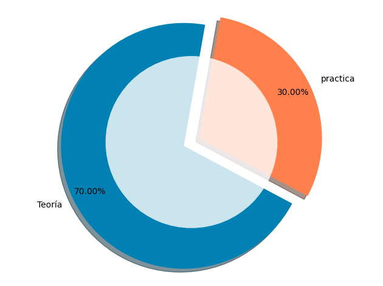
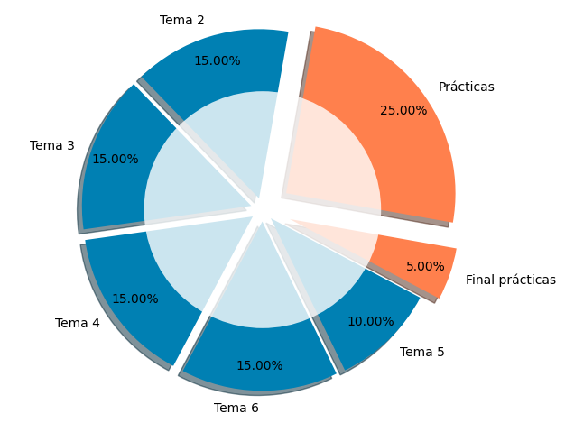
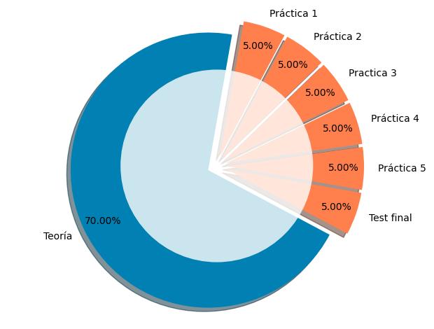
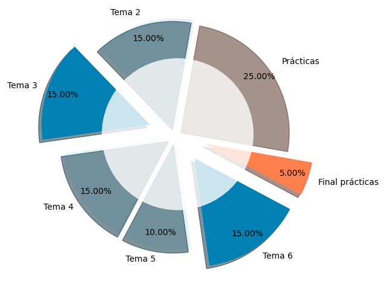

# Sistema de Evaluación de la Asignatura

## Estructura General de la Evaluación

La evaluación de la asignatura se articula en dos componentes fundamentales: una parte teórica y una parte práctica, con ponderaciones del 70% y 30% respectivamente sobre la calificación final.

Esta distribución responde a la naturaleza de la asignatura, donde los fundamentos teóricos constituyen la base conceptual imprescindible, complementada con una componente práctica que permite la aplicación y consolidación de los conocimientos adquiridos.

## Evaluación de la Parte Teórica (70%)

El contenido teórico de la asignatura se organiza en seis temas, cada uno con una ponderación específica que refleja su importancia relativa en el conjunto de la materia:

La distribución de pesos es la siguiente:

- **Tema 1**: No se evalúa (0%)
- **Tema 2**: 15%
- **Tema 3**: 15%
- **Tema 4**: 15%
- **Tema 5**: 10%
- **Tema 6**: 15%

Es importante destacar que el Tema 3 ocupa una posición central en el desarrollo de la asignatura, al constituir la base conceptual sobre la que se edifican los temas posteriores. Por este motivo, y para mantener estos conocimientos actualizados durante el desarrollo del curso, se ha decidido mantener su evaluación hasta la convocatoria final. El Tema 6, por su parte, se evalúa en la convocatoria final por razones de organización logística del calendario académico.

### Metodología de Evaluación Teórica

Todos los exámenes teóricos son de carácter individual y se realizan mediante el sistema de evaluación automática CASIUM, desarrollado por el equipo docente de la asignatura. Este sistema presenta características singulares que garantizan la equidad y la objetividad del proceso evaluativo:

- **Versatilidad**: El sistema genera más de 2^160 combinaciones posibles para cada examen, lo que permite a los estudiantes practicar de forma ilimitada en condiciones idénticas a las del examen oficial.

- **Determinismo**: Para cada estudiante, en cada fecha de examen y desde cada dirección IP, el sistema asigna una versión específica del examen de manera completamente determinista, garantizando la trazabilidad y la imposibilidad de duplicación.

- **Transparencia**: Dado que los estudiantes pueden realizar múltiples ensayos previos en condiciones equivalentes a las del examen oficial, el sistema prácticamente elimina la necesidad de procesos de revisión, al tiempo que garantiza la igualdad de condiciones para todos los evaluados.

## Evaluación de la Parte Práctica (30%)

La componente práctica se estructura en dos elementos evaluables:

1. **Cinco prácticas de laboratorio**: Cada una aporta 5 puntos, hasta un total de 25 puntos sobre la calificación final.

2. **Test de prácticas**: Incluido en el examen final, con un valor de 5 puntos adicionales.

La distribución equitativa del peso entre las cinco prácticas responde al criterio de que todas ellas tienen una importancia similar en el desarrollo de las competencias prácticas de la asignatura.

## Sistema de Evaluación Continua

La asignatura implementa un sistema de evaluación continua que permite a los estudiantes superar progresivamente diferentes componentes de la materia antes de la convocatoria final. En concreto, es posible eliminar el 65% de la asignatura mediante las pruebas de evaluación continua:

- **Temas 2, 4 y 5** de la parte teórica
- **Las cinco prácticas de laboratorio**

Este sistema de evaluación continua facilita una distribución más equilibrada del esfuerzo del estudiante a lo largo del curso y permite una retroalimentación temprana sobre el proceso de aprendizaje.

## Examen Final

La convocatoria final de junio comprende los elementos que no han sido objeto de evaluación continua, representando el 35% restante de la calificación:

Los componentes del examen final son:

- **Tema 3**: Mantenido hasta el final por su carácter fundamental y transversal
- **Tema 6**: Evaluado en la convocatoria final por criterios organizativos
- **Test de prácticas**: Evaluación final de los conocimientos prácticos adquiridos (5 puntos)

Esta estructura garantiza que todos los estudiantes demuestren el dominio de los contenidos más relevantes de la asignatura en la evaluación final, independientemente de su rendimiento en la evaluación continua.
